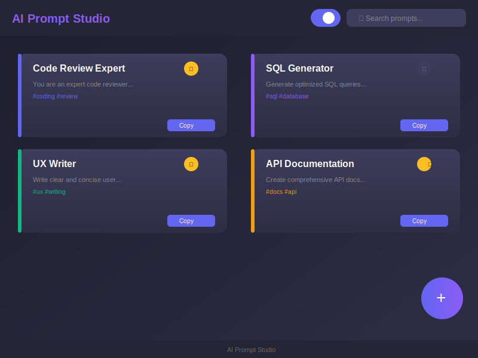
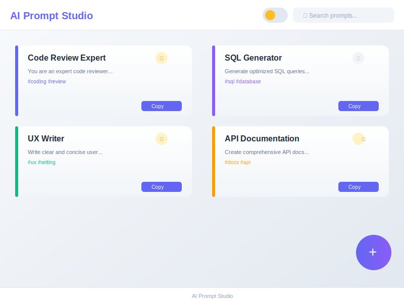
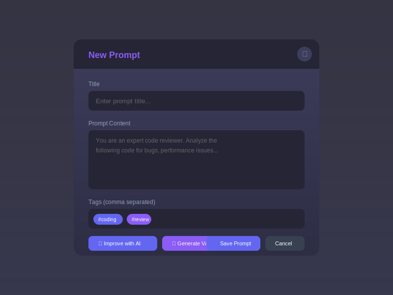
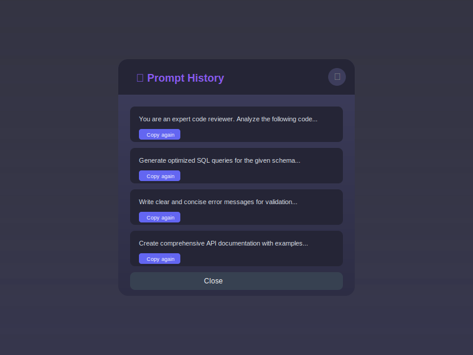

# AI Prompt Studio

Extensão Chrome para gerenciamento de prompts de IA com recursos avançados e sistema de anotações wiki.

## Screenshots

### Dark Mode (Padrão)


### Light Mode


### Editor de Prompts


### Histórico


## Funcionalidades

### Core
- Criar, editar, copiar e excluir prompts
- Melhorar prompts com IA (Gemini)
- Gerar variações de prompts
- Sugestões de enhancement
- dark/light mode

### Wiki/Notas (Novidade!)
Sistema completo de anotações estilo Notion:
- **Criação de páginas** - Crie páginas de anotações ilimitadas
- **Links entre páginas** - Use `[[Nome da Página]]` para linkar páginas
- **Auto-complete** - Sugestões ao digitar `[[`
- **Backlinks** - Veja quais páginas linkam para a atual
- **Busca global** - Encontre qualquer nota pelo título ou conteúdo
- **Tags** - Organize páginas com tags
- **Preview** - Visualize markdown antes de salvar

### Avançadas
- **History** - Salva os últimos 50 prompts copiados
- **Favoritos** - Marca prompts favoritos com um clique
- **Tags** - Organize prompts com tags e categorias
- **Contagem de uso** - Acompanha quantas vezes cada prompt foi usado
- **Export/Import** - Backup em JSON, sincronize entre dispositivos
- **Atalhos de teclado**
  - `Ctrl+N` - Novo prompt
  - `Ctrl+F` - Buscar prompts
  - `Ctrl+W` - Alternar entre Prompts/Wiki
  - `Esc` - Fechar modal

## Como Instalar

### Pré-requisitos
- **Node.js** 18 ou superior
- **npm** ou **yarn**
- **Chrome/Edge/Brave** (navegador baseado em Chromium)
- **Conta Gemini API** (obtenha em [Google AI Studio](https://aistudio.google.com/))

### Passo a Passo

```bash
# 1. Clone o repositório
git clone https://github.com/Jailtonfonseca/chrome_exten_prompt_note.git
cd chrome_exten_prompt_note

# 2. Instale as dependências
npm install

# 3. Configure a API Key do Gemini
echo "VITE_GEMINI_API_KEY=sua_chave_aqui" > .env.local
```

Edite o arquivo `.env.local` e substitua `sua_chave_aqui` pela sua chave da API Gemini.

```bash
# 4. Execute em modo desenvolvimento
npm run dev
```

### Carregar a Extensão no Chrome

1. Abra **chrome://extensions/** no Chrome
2. Ative o **Modo do desenvolvedor** (switch no canto superior direito)
3. Clique em **"Carregar sem compactação"**
4. Navegue até a pasta `/dist` do projeto
5. A extensão "AI Prompt Studio" aparecerá na lista

### Solução de Problemas

| Problema | Solução |
|----------|---------|
| `npm install` falha | Verifique se Node.js >= 18 está instalado: `node -v` |
| Extensão não aparece | Verifique se a pasta `/dist` existe após `npm run dev` |
| API de IA não funciona | Confirme que a `VITE_GEMINI_API_KEY` está correta no `.env.local` |
| Erro de build | Execute `npm run build` antes de carregar a extensão |

### Build de Produção

```bash
# Gerar versão otimizada
npm run build

# A pasta /dist será criada/atualizada
# Carregue esta pasta no Chrome conforme instruções acima
```

## Tecnologias
- React + TypeScript
- Vite
- Gemini API
- TailwindCSS

## Keyboard Shortcuts
- `Ctrl+N` - New prompt
- `Ctrl+F` - Search
- `Ctrl+W` - Toggle Prompts/Wiki
- `Esc` - Close modal
